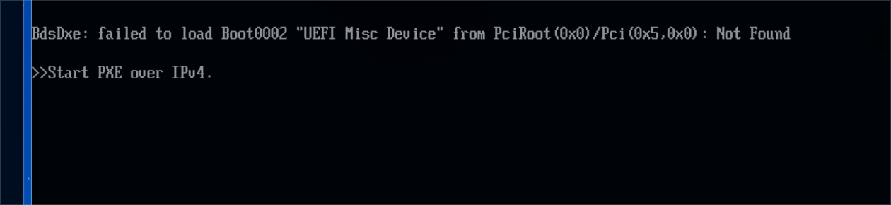

# Luminal Linux

<div align="center">



### Luminosity. Fluidity. Performance.
*A modern, crafted Arch Linux distribution engineered for bleeding-edge Wayland desktop ergonomics.*

[](https://archlinux.org)
[](https://hyprland.org)
[](https://github.com/caelestia-dots/shell)
[](.github/workflows/build-iso.yml)
[](LICENSE)

[**Download Latest ISO**](https://github.com/ibnyusrat/luminal-linux/releases) • [**Keybindings Cheatsheet**](#complete-shortcuts--keybindings-cheatsheet) • [**Installation Guide**](#installation-guide) • [**Build From Source**](#building-the-iso-locally)

</div>

---

## TL;DR (Quick Overview)

Luminal Linux is an independent, out-of-the-box Arch Linux rolling release designed to replace cluttered desktop environments with a unified, high-performance Wayland ecosystem.

* **Compositor:** [Hyprland](https://hyprland.org) configured with modular Lua scripts.
* **Atmospheric UI:** [Caelestia Shell](https://github.com/caelestia-dots/shell) (Quickshell QML) with dynamic Material You color extraction from wallpapers.
* **Live Video Wallpapers:** Smart `mpvpaper` daemon that automatically pauses playback when windows cover the screen (zero wasted GPU/battery).
* **Terminal Experience:** [Kitty](https://sw.kovidgoyal.net/kitty/) with custom cursor shaders, Zsh, Oh-My-Zsh, and pre-configured Powerlevel10k.
* **30-Second Installer:** 100% offline instant system cloner with network-assisted GeoIP timezone auto-detection.
* **Modern Boot Stack:** Plymouth OEM BGRT boot splash with Triple-Preset Unified Kernel Images (UKI).
* **Automated Rolling CI:** Fresh ISO releases compiled automatically every week via GitHub Actions.

---

## Complete Shortcuts & Keybindings Cheatsheet

> **Note:** The `SUPER` key is the Windows / Command key on your keyboard. `Caps Lock` is remapped to `Escape` system-wide.

### Core Applications & System Controls

| Keybinding | Action | Description |
| :--- | :--- | :--- |
| <kbd>SUPER</kbd> + <kbd>T</kbd> / <kbd>Return</kbd> | **Open Terminal** | Launches GPU-accelerated Kitty terminal |
| <kbd>ALT</kbd> + <kbd>Space</kbd> | **App Launcher** | Interactive search & application runner |
| <kbd>SUPER</kbd> + <kbd>E</kbd> | **File Manager** | Opens Thunar with custom context actions |
| <kbd>SUPER</kbd> + <kbd>W</kbd> | **Web Browser** | Opens Firefox |
| <kbd>SUPER</kbd> + <kbd>C</kbd> | **Code Editor** | Opens VSCodium / VS Code |
| <kbd>CTRL</kbd> + <kbd>ALT</kbd> + <kbd>V</kbd> | **Volume Mixer** | Pavucontrol audio interface |
| <kbd>SUPER</kbd> + <kbd>V</kbd> | **Clipboard History** | Cliphist clipboard picker |
| <kbd>SUPER</kbd> + <kbd>.</kbd> | **Emoji Picker** | Searchable system emoji picker |
| <kbd>SUPER</kbd> + <kbd>F12</kbd> | **Toggle Mac Shortcuts** | Instant live switch between macOS shortcuts (`keyd`) and standard Linux/Windows layout |
| <kbd>CTRL</kbd> + <kbd>ALT</kbd> + <kbd>Delete</kbd> | **Power / Session** | Sleep, Restart, Shutdown, or Logout dialog |
| <kbd>SUPER</kbd> + <kbd>L</kbd> | **Lock Screen** | Instant Wayland screen lock |
| <kbd>SUPER</kbd> + <kbd>SHIFT</kbd> + <kbd>L</kbd> | **Sleep / Suspend** | Suspends system to RAM |

---

### Window Management & Tiling

| Keybinding | Action | Description |
| :--- | :--- | :--- |
| <kbd>SUPER</kbd> + <kbd>Q</kbd> | **Close Window** | Closes the currently active window |
| <kbd>SUPER</kbd> + <kbd>F</kbd> | **Fullscreen** | Toggles true fullscreen mode |
| <kbd>SUPER</kbd> + <kbd>ALT</kbd> + <kbd>Space</kbd> | **Floating Mode** | Toggles between tiling and floating window |
| <kbd>SUPER</kbd> + <kbd>P</kbd> | **Pin Window** | Pins window across all virtual workspaces |
| <kbd>SUPER</kbd> + <kbd>Z</kbd> | **Move Window** | Interactive window movement mode |
| <kbd>SUPER</kbd> + <kbd>X</kbd> | **Resize Window** | Interactive window resizing mode |
| <kbd>SUPER</kbd> + <kbd>Minus</kbd> / <kbd>Equal</kbd> | **Adjust Width** | Decreases / increases active window width |
| <kbd>SUPER</kbd> + <kbd>SHIFT</kbd> + <kbd>- / =</kbd> | **Adjust Height** | Decreases / increases active window height |
| <kbd>SUPER</kbd> + <kbd>G</kbd> / <kbd>SHIFT</kbd> + <kbd>G</kbd> | **Adjust Gaps** | Increases / decreases window gaps in real time |
| <kbd>ALT</kbd> + <kbd>Tab</kbd> | **Cycle Windows** | Cycles focus between tabbed window groups |
| <kbd>SUPER</kbd> + <kbd>U</kbd> | **Ungroup Window** | Detaches a window from a grouped tab stack |

---

### Screenshots, Screen Recording & Utilities

| Keybinding | Action | Output / Behavior |
| :--- | :--- | :--- |
| <kbd>CTRL</kbd> + <kbd>ALT</kbd> + <kbd>SHIFT</kbd> + <kbd>4</kbd> *(or <kbd>CTRL</kbd>+<kbd>SUPER</kbd>+<kbd>SHIFT</kbd>+<kbd>4</kbd>)* | **Region to Clipboard** | Interactive selection; copies area directly to clipboard |
| <kbd>ALT</kbd> + <kbd>SHIFT</kbd> + <kbd>4</kbd> *(or <kbd>SUPER</kbd>+<kbd>SHIFT</kbd>+<kbd>ALT</kbd>+<kbd>S</kbd>)* | **Region to File** | Interactive selection; saves screenshot to `~/Pictures/Screenshots` |
| <kbd>Print</kbd> | **Full Screenshot** | Captures all connected displays instantly |
| <kbd>SUPER</kbd> + <kbd>SHIFT</kbd> + <kbd>S</kbd> | **Freeze Capture** | Freezes screen before area selection (Wayfreeze) |
| <kbd>CTRL</kbd> + <kbd>ALT</kbd> + <kbd>R</kbd> | **Screen Recorder** | GPU-accelerated video recording (GPU Screen Recorder) |
| <kbd>SUPER</kbd> + <kbd>SHIFT</kbd> + <kbd>C</kbd> | **Color Picker** | Hyprpicker magnifying loupe; copies HEX to clipboard |

---

### macOS Shortcuts Layer (`keyd`)

The system includes pre-configured, low-latency kernel-level shortcut translation via `keyd`:

* **`ALT` acts as `CMD` (Navigation & App Control)**:
  * <kbd>ALT</kbd> + <kbd>Backspace</kbd>: Delete whole line to the left
  * <kbd>ALT</kbd> + <kbd>Left</kbd> / <kbd>Right</kbd>: Jump to start / end of line
  * <kbd>ALT</kbd> + <kbd>Up</kbd> / <kbd>Down</kbd>: Jump to top / bottom of document or page
  * <kbd>ALT</kbd> + <kbd>C</kbd> / <kbd>V</kbd> / <kbd>X</kbd> / <kbd>Z</kbd> / <kbd>A</kbd>: Copy, Paste, Cut, Undo, Select All
  * <kbd>ALT</kbd> + <kbd>T</kbd> / <kbd>W</kbd> / <kbd>L</kbd> / <kbd>R</kbd>: New Tab, Close Tab, Address Bar, Refresh (Chrome/Firefox)
  * <kbd>ALT</kbd> + <kbd>1</kbd> .. <kbd>9</kbd>: Switch tabs 1–9
* **`SUPER` acts as `OPTION` (Word Navigation & Word Deletion)**:
  * <kbd>SUPER</kbd> + <kbd>Backspace</kbd>: Delete word to the left (works in browsers, editors, and terminal)
  * <kbd>SUPER</kbd> + <kbd>Delete</kbd>: Delete word to the right
  * <kbd>SUPER</kbd> + <kbd>Left</kbd> / <kbd>Right</kbd>: Jump word by word
  * <kbd>SUPER</kbd> + <kbd>SHIFT</kbd> + <kbd>Left</kbd> / <kbd>Right</kbd>: Select word by word
* **Instant Toggle**:
  * Press <kbd>SUPER</kbd> + <kbd>F12</kbd> or run `macmode` in terminal to instantly toggle between Mac mode and standard Linux/Windows layout.

### Workspaces & Special Scratchpads

| Keybinding | Target Workspace |
| :--- | :--- |
| <kbd>SUPER</kbd> + <kbd>1</kbd> .. <kbd>9</kbd> | Switch to Workspace **1 through 9** |
| <kbd>SUPER</kbd> + <kbd>ALT</kbd> + <kbd>1</kbd> .. <kbd>9</kbd> | Move Active Window to Workspace **1 through 9** |
| <kbd>SUPER</kbd> + <kbd>S</kbd> | Toggle General **Scratchpad Workspace** |
| <kbd>CTRL</kbd> + <kbd>SHIFT</kbd> + <kbd>Escape</kbd> | Toggle Dedicated **System Monitor Scratchpad** (Btop) |
| <kbd>SUPER</kbd> + <kbd>M</kbd> | Toggle Dedicated **Music / Media Scratchpad** |
| <kbd>SUPER</kbd> + <kbd>D</kbd> | Toggle Dedicated **Communication Scratchpad** (Discord / Slack) |
| <kbd>SUPER</kbd> + <kbd>R</kbd> | Toggle Dedicated **Todo / Notes Scratchpad** |

---

## Architecture & Distro Features

| Layer | Component | Description & Technologies |
| :--- | :--- | :--- |
| **Desktop Environment** | **Hyprland + Caelestia Shell** | Wayland compositor scripted via Lua, Quickshell QML widgets, Material You dynamic theming |
| **Session Management** | **UWSM** | Universal Wayland Session Manager with complete systemd user service integration |
| **Display Manager** | **SDDM** | Qt6/QML login greeter launched via Labwc Wayland backend |
| **Kernel & Bootloader** | **systemd-boot + UKI** | Unified Kernel Images (UKI) with Plymouth BGRT smooth boot splash |
| **Base System** | **Arch Linux Rolling** | Minimal, bloat-free rolling release base with pacman & yay AUR access |

### 1. Dynamic Material You Theming
* Setting a wallpaper (via right-click in Thunar or `set_wallpaper.sh`) automatically triggers `caelestia-cli` to extract dominant and complementary color palettes.
* GTK themes, window borders, shell widgets, lock screen, and SDDM update their color schemes **in real time**.

### 2. Smart Live Video Wallpapers
* Powered by `mpvpaper` with hardware-accelerated video decoding.
* Includes **`smart_pause.sh`**: A background daemon that monitors Hyprland window focus and dimensions. When a maximized or tiled window covers the wallpaper, video playback instantly pauses, dropping GPU usage to 0%.

### 3. Native Thunar Custom Actions (UCA)
Right-clicking any media file in Thunar provides instant options:
* **Set as Desktop Wallpaper:** Applies static wallpaper and regenerates color palettes.
* **Set as Live Video Wallpaper:** Launches the video wallpaper daemon with audio muted.
* **Extract Audio / Compress Video:** Built-in shell utilities.

---

## Installation Guide

### Option 1: Fast 30-Second Offline Installer (Recommended)

1. Boot your live USB or VM.
2. In the **Welcome Center** that opens on your desktop, select:  
   `[1] Install Custom Arch Linux to Disk`  
   *(Or click **Install Custom Arch Linux** in the application launcher).*
3. Confirm your timezone (auto-detected from network or select via `fzf`).
4. Select your target storage drive (e.g. `/dev/nvme0n1` or `/dev/sda`).
5. Choose your username, password, and hostname.
6. The installer will format, clone the configured desktop, install the UKI bootloader, and complete in **~30 seconds** with zero internet required.

---

### Option 2: Online Guided archinstall

If you prefer custom partition layouts or network mirror synchronization:
1. Open a terminal and run `sudo archinstall`.
2. Select your desired disk layout and package mirrors.
3. The installer will synchronize packages from the fastest global HTTPS mirrors.

---

## Testing in a Virtual Machine (QEMU / KVM)

Test the complete ISO installation lifecycle safely inside an accelerated virtual machine:

### 1. Install & Test-Drive in VM:
```bash
# Automatically creates a 30GB virtual disk and boots the live ISO
./scripts/test-install-vm.sh
```
* Release cursor from VM: Press <kbd>Ctrl</kbd> + <kbd>Alt</kbd> + <kbd>G</kbd>.

### 2. Boot the Installed System (Without the ISO):
```bash
# Boots directly from the virtual hard disk to verify the installed OS
./scripts/boot-installed-vm.sh
```

---

## Building the ISO Locally

### Prerequisites
Install the `archiso` build tool on your host Arch Linux system:
```bash
sudo pacman -S --needed archiso git base-devel
```

### Build Command
Run the master build script from the repository root:
```bash
./build-iso.sh
```

The script runs pre-flight syntax and configuration checks, compiles/syncs local AUR packages, executes `mkarchiso`, and generates the bootable image at:
```text
out/luminal-linux-YYYY.MM.DD-x86_64.iso
```

---

## Automated Weekly GitHub Actions CI/CD

Luminal Linux features an automated GitHub Actions workflow (`.github/workflows/build-iso.yml`):

* **Cron Schedule:** Executes automatically every **Sunday at 00:00 UTC**.
* **Fresh Packages:** Pulls the newest Arch Linux packages, Linux kernel, and AUR updates.
* **GitHub Releases:** Automatically calculates SHA256 checksums and publishes a public release with direct ISO download links.

To trigger a manual build on demand:
1. Go to your GitHub repository.
2. Navigate to **Actions** -> **Build & Release Custom Arch Linux ISO**.
3. Click **Run workflow**.

---

## Repository Anatomy

```text
custom-arch-distro/
├── airootfs/                               # Live rootfs overlay
│   ├── etc/
│   │   ├── default/useradd                 # Sets default shell to /bin/zsh
│   │   ├── pacman.d/                       # Mirrorlist & pacman hooks
│   │   ├── plymouth/plymouthd.conf         # Plymouth OEM BGRT boot theme
│   │   ├── sddm.conf.d/autologin.conf      # Live session autologin
│   │   ├── skel/                           # Default user skeleton configs (~/.config)
│   │   └── systemd/system-preset/          # Default enabled systemd services
│   └── usr/
│       ├── local/bin/                      # Installer & helper scripts
│       └── share/backgrounds/distro/       # Built-in live & static wallpapers
├── efiboot/                                # UEFI bootloader configurations
├── grub/                                   # GRUB boot configurations
├── syslinux/                               # BIOS bootloader configurations
├── repo/                                   # Local pre-compiled AUR package repository
├── scripts/
│   ├── build-aur-repo.sh                   # Builds & indexes custom AUR packages
│   ├── test-distro-configs.sh              # Pre-flight test suite (Lua/JSON/Shell/XML)
│   ├── test-install-vm.sh                  # Launches VM with virtual target drive
│   └── boot-installed-vm.sh                # Boots the virtual drive without ISO
├── .github/workflows/build-iso.yml         # Automated GitHub Actions build pipeline
├── packages.x86_64                         # Master package manifest
├── pacman.conf                             # Pacman repo configurations
├── profiledef.sh                           # Archiso profile definitions & permissions
├── build-iso.sh                            # Master automated build entrypoint
└── README.md                               # Project documentation
```

---

## License

Luminal Linux is open-source software licensed under the [MIT License](LICENSE).  
Arch Linux is a registered trademark of Levente Polyak.
